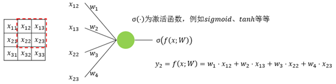
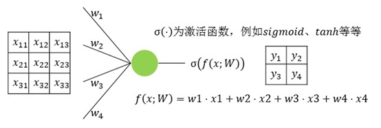

# Advanced Deep Learning with Keras摘录

Advanced Deep Learning with Keras——Apply deep learning techniques, autoencoders, GANs, variational autoencoders, deep reinforcement learning, policy gradients, and more

作者：**Rowel Atienza**

## 1. Keras是完美的深度学习包

Keras [*Chollet, François. "Keras (2015)." (2017)*]是深度学习领域最为流行的包库之一，超过25万开发者使用，并且每年以两倍的速度增加。Google的TensorFlow平台采用Keras作为高级API；在工业领域，Keras广泛被各大科技公司使用，包括Google、Netflix、Uber、NVIDIA等。

Keras包库致力于实现快速开发深度学习模型，这使得Keras成为深度学习实践应用的理想选择。Keras使得构造深度学习模型变得非常高效。在Keras中，神经层可以像Lego一样相互连接，使得模型结构清晰且易于理解。模型训练也仅需要数据、训练阶段数（epochs）、监测指标等。大部分深度学习模型都能用很少的代码实现。

### 1.1 安装Keras及相关包库

Google's  TensorFlow, MILA's Theano or Microsoft's CNTK. Support for Apache's MXNet is  nearly completed. 

On hardware, Keras runs on a CPU, GPU, and Google's TPU. 

The examples presented in this book will require additional packages, such as  pydot, pydot_ng, vizgraph, python3-tk and matplotlib. 

## 2. 实现深度学习核心模型——MLPs, CNNs, and RNNs

- MLPs: Multilayer perceptrons 多层感知机
- RNNs: Recurrent neural networks 循环神经网络
- CNNs: Convolutional neural networks 卷积神经网络

### 2.1 MLP，CNN，RNN的区别

#### MLP

单个感知器（或神经元）可以被想象成逻辑回归。多层感知器（MLP），是每一层上的一组多个感知器。因为输入仅单方向地向前处理，所以MLP也被称为前馈神经网络（ Feed-Forward Neural network）。MLP由三层组成——输入层、隐藏层和输出层。输入层仅接收输入，隐藏层处理输入，输出层生成结果。基本上，每一层都要训练权值。多层感知器能够学习任意非线性函数。因此，这些网络被普遍称为通用函数逼近器（Universal Function Approximator）。MLP能够学习将任何输入映射到输出的权重。通用逼近背后的主要原因之一是激活函数（activation function）。激活函数将非线性特征引入网络中，有助于网络学习输入和输出之间的复杂关系。每个神经元的输出都是输入加权和的激活。但是，如果没有激活函数会怎样呢？该网络仅学习线性函数，但不学习复杂关系，原因是：**激活函数是多层感知器的核心！**


在利用MLP解决图像分类问题时，首先要将二维图像转换成一维向量，然后再对模型进行训练。这样做有两个缺点：（1）随着图像尺寸的增大，可训练参数的数量会急剧增加。（2）MLP会丢失图像的空间特征。空间特征指的是图像中像素的排列。

在所有这些神经网络中，存在一个共同问题：梯度消失与爆炸（Vanishing and Exploding Gradient）。此问题与反向传播（backpropagation）算法有关。反向传播算法通过寻找梯度来更新神经网络的权值。因此，在非常深的神经网络（具有大量隐藏层的网络）中，梯度会随着向后传播而消失或爆炸，从而导致梯度消失与爆炸（Vanishing and Exploding Gradient）。MLP无法捕获处理序列数据所需的输入数据中的顺序信息。

#### 循环神经网络（RNN）

MLP隐藏层上的环形约束转向RNN。RNN在隐藏状态上有一个循环连接，此循环约束能够确保在输入数据中捕捉到顺序信息。


RNN能够捕捉数据中出现的顺序信息，例如，预测时文本中单词之间的依赖关系：每个时间步长的输出（o1, o2, o3, o4）不仅取决于当前单词，还取决于先前的单词。


RNN跨不同的时间步长共享参数。这通常被称为参数共享（Parameter Sharing）。这将减少训练参数并降低计算成本。如图所示，U、W、V 这3个权值矩阵是所有时间步长中共享的权值矩阵。


深度RNN（具有大量时间步长的RNN）也存在梯度消失和爆炸问题，这是在所有不同类型神经网络中常见的问题。如图所示，在最后一个时间步长处计算的梯度在到达初始时间步长时消失。


#### 卷积神经网络（CNN）

卷积神经网络（CNN）目前在深度学习领域非常热门。这些CNN模型被应用于不同的应用和领域，在图像和视频处理项目中尤其普遍。

CNN的构建块是过滤器，也就是内核。内核的作用是利用卷积运算从输入中提取相关特征。我们可以试着了解一下使用图像作为输入数据的过滤器的重要性。将图像与过滤器进行卷积会生成一个特征图（feature map）：


尽管引入卷积神经网络的初衷是要解决与图像数据相关的问题，但它们在顺序输入上的表现也十分出色。

CNN能够自动学习过滤器。这些过滤器有助于从输入数据中提取正确的相关特征。

CNN从图像中捕捉空间特征（spatial features）。空间特征指的是像素在图像中的排列以及它们之间的关系。它们能够帮助我们准确地识别物体、物体位置、以及它与图像中其他物体的关系。

#### 总结


DNN指的是包含多个隐层的神经网络，如图1所示，根据神经元的特点，可以分为MLP、CNN、RNN等，下文在区分三者的时候，都从神经元的角度来讲解。MLP是最朴素的DNN，CNN是encode了空间相关性的DNN，RNN是encode进了时间相关性的DNN。


图1

MLP是最简单的DNN，它的每一层其实就是fc层（fully connected layer），其神经元见图2所示。


图2

CNN相对于MLP而言，多了一个先验知识，即数据之间存在空间相关性，比如图像，蓝天附近的像素点是白云的概率会大于是水桶的概率。滤波器会扫过整张图像，在扫的过程中，参数共享。图3、图4、图5、图6是一个3x3的输入经过一个2x2的conv的过程，该conv的stride为1，padding为0。图7是最后的计算结果。


图3



图4


图5


图6



图7

RNN相对于MLP而言，也多了一个先验知识，即数据之间存在时间相关性，比如一段文字，前面的字是“上”，后面的字是“学”概率更大，是“狗”的概率很小。RNN神经元的输入会有多个time step，每个time step的输入进入神经元中时会共享参数。图8是一个典型的RNN示意图，图9是将图8在时间上展开的结果，这里只展开了两步。


图8


图9

#### 2.2 使用MNIST数据库

```Python
import numpy as np
from keras.datasets import mnist
import matplotlib.pyplot as plt
# load dataset
(x_train, y_train), (x_test, y_test) = mnist.load_data()
# count the number of unique train labels
unique, counts = np.unique(y_train, return_counts=True)
print("Train labels: ", dict(zip(unique, counts)))
# count the number of unique test labels
unique, counts = np.unique(y_test, return_counts=True)
print("Test labels: ", dict(zip(unique, counts)))
# sample 25 mnist digits from train dataset
indexes = np.random.randint(0, x_train.shape[0], size=25)
images = x_train[indexes]
labels = y_train[indexes]
# plot the 25 mnist digits
plt.figure(figsize=(5,5))
for i in range(len(indexes)):
     plt.subplot(5, 5, i + 1)
     image = images[i]
     plt.imshow(image, cmap='gray')
     plt.axis('off')
plt.show()
plt.savefig("mnist-samples.png")
plt.close('all')
```

MNIST数据是2D张量，需要根据输入类型进行reshaped。


如图，3*3的数据被reshape成符合MLP、CNN、RNN要求的输入数据。

## 3. MLP分类器实现


```Python
import numpy as np
from keras.models import Sequential
from keras.layers import Dense, Activation, Dropout
from keras.utils import to_categorical, plot_model
from keras.datasets import mnist
# load mnist dataset
(x_train, y_train), (x_test, y_test) = mnist.load_data()
# compute the number of labels 
num_labels = len(np.unique(y_train))
# convert to one-hot vector 转换
y_train = to_categorical(y_train)
y_test = to_categorical(y_test)
# image dimensions (assumed square)
image_size = x_train.shape[1]
input_size = image_size * image_size
# resize and normalize 在训练之前要进行reshape。
# 标准化，可以避免值梯度过大而增加训练难度
#  there is an option to put everything back to the integer pixel values by multiplying the output tensor by 255.
x_train = np.reshape(x_train, [-1, input_size])
x_train = x_train.astype('float32') / 255
x_test = np.reshape(x_test, [-1, input_size])
x_test = x_test.astype('float32') / 255
# network parameters
batch_size = 128
hidden_units = 256
dropout = 0.45
# model is a 3-layer MLP with ReLU and dropout after each layer
model = Sequential()
model.add(Dense(hidden_units, input_dim=input_size))
model.add(Activation('relu'))
model.add(Dropout(dropout))
model.add(Dense(hidden_units))
model.add(Activation('relu'))
model.add(Dropout(dropout))
model.add(Dense(num_labels))
# this is the output for one-hot vector
model.add(Activation('softmax'))
model.summary()
plot_model(model, to_file='mlp-mnist.png', show_shapes=True)
# loss function for one-hot vector
# use of adam optimizer
# accuracy is a good metric for classification tasks
model.compile(loss='categorical_crossentropy', optimizer='adam', metrics=['accuracy'])
# train the network
model.fit(x_train, y_train, epochs=20, batch_size=batch_size)
# validate the model on test dataset to determine generalization
loss, acc = model.evaluate(x_test, y_test, batch_size=batch_size)
print("\nTest accuracy: %.1f%%" % (100.0 * acc))
```

深度学习中，数据以张量的形式存储。0维张量是标量，1维张量是向量（矢量），2维张量是矩阵，还有多维张量。

由于Dense层是线性操作，一系列Dense层仅可逼近线性函数。在Dense层之间插入*relu*激活函数可以使MLP具有非线性映射功能。*relu*或**线性整流函数**（Rectified Linear Unit, **ReLU**），又称**修正线性单元，**是一种人工神经网络中常用的激活函数（activation function），通常指代以斜坡函数及其变种为代表的非线性函数。ReLU像一个过滤器，使正输入通过不发生改变，其他的归零。


其他的非线性函数如：elu，selu，softplus，sigmoid，tanh等。然而，ReLU由于简便而在深度学习领域应用最广泛。


*Dropout*层是一种可以用于减少神经网络过拟合的结构。Dropout则是在每一个batch的训练当中随机减掉一些神经元。因为越大的神经网络就越有可能产生过拟合，因此随机删除一些神经元就可以防止其过拟合了，也就是让拟合的结果没那么准确。神经元个数较多，容易产生过拟合，因此将其加上dropout的结构，而后面神经元个数较少的地方就不用加了。

在机器学习中，我们非常关心模型的预测能力，即模型在新数据上的表现，而不希望过拟合现象的的发生，我们通常使用正则化（regularization）技术来防止过拟合情况。正则化是机器学习中通过显式的控制模型复杂度来避免模型过拟合、确保泛化能力的一种有效方式。如果将模型原始的假设空间比作“天空”，那么天空飞翔的“鸟”就是模型可能收敛到的一个个最优解。在施加了模型正则化后，就好比将原假设空间（“天空”）缩小到一定的空间范围（“笼子”），这样一来，可能得到的最优解能搜索的假设空间也变得相对有限。有限空间自然对应复杂度不太高的模型，也自然对应了有限的模型表达能力。这就是“正则化有效防止模型过拟合的”一种直观解析。

在深度学习中，用的比较多的正则化技术是L2正则化。L2约束通常对稀疏的有尖峰的权重向量施加大的惩罚，而偏好于均匀的参数。这样的效果是鼓励神经单元利用上层的所有输入，而不是部分输入。所以L2正则项加入之后，权重的绝对值大小就会整体倾向于减少，尤其不会出现特别大的值（比如噪声），即网络偏向于学习比较小的权重。所以L2正则化在深度学习中还有个名字叫做“权重衰减”（weight decay），也有一种理解这种衰减是对权值的一种惩罚，所以有些书里把L2正则化的这一项叫做惩罚项（penalty）。L1 正则化除了和L2正则化一样可以约束数量级外，L1正则化还能起到使参数更加稀疏的作用，稀疏化的结果使优化后的参数一部分为0，另一部分为非零实值。非零实值的那部分参数可起到选择重要参数或特征维度的作用，同时可起到去除噪声的效果。此外，L1正则化和L2正则化可以联合使用，这种形式也被称为“Elastic网络正则化”。

```python
from keras.regularizers import l2
model.add(Dense(hidden_units, kernel_regularizer=l2(0.001), input_dim=input_size))
```

输出层的激活函数采用*softmax*。


其他的输出层激活函数有：linear，sigmoid（logistic sigmoid），tanh。


常用的损失函数之一是均方差*mean_squared_error，mse*，还有交叉熵损失函数categorical_crossentropy，mean_absolute_error, binary_crossentropy。For classification by category, categorical_crossentropy or mean_squared_error is a good choice after the softmax activation layer. The  binary_crossentropy loss function is normally used after the sigmoid activation  layer while mean_squared_error is an option for tanh output.

优化目标是最小化损失函数。Keras中默认的性能度量是损失（预测值和真实值之差）。在训练、验证、测试中，还可以将精度作为性能度量。

Keras中有几种优化器，最常用的有随机梯度下降Stochastic Gradient Descent (SGD), 自适应矩估计Adaptive Moments Estimation (Adam),  均方根传递Root Mean Squared Propagation (RMSprop)。每个优化器都有一些特征参数，如：学习率、矩momentum、衰减decay。Adam和RMSprop是具有自适应学习率的SGD。

指定了训练集、损失函数、优化器、正则方法后，就可以进行模型训练。

```python
# loss function for one-hot vector
# use of adam optimizer
# accuracy is a good metric for classification tasks
model.compile(loss='categorical_crossentropy', optimizer='adam', metrics=['accuracy'])
# train the network
model.fit(x_train, y_train, epochs=20, batch_size=batch_size)
```

仅需提供*x*和*y*数据、训练阶段数、抽样集大小，*fit()*就能完成剩下的工作。

下图为不同的MLP网络配置和性能评价：


模型配置完毕后，可查看打印模型的参数：

```python
model.summary()
plot_model(model, to_file='mlp-mnist.png', show_shapes=True)
```

## 4. 卷积神经网络 Convolutional neural networks (CNNs)